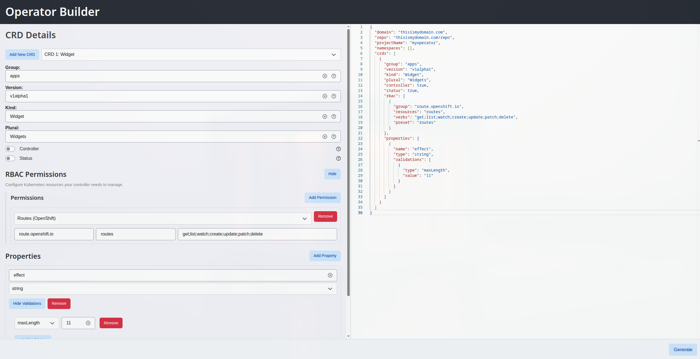

# OSDK-Web: Kubernetes Operator Builder
https://github.com/user-attachments/assets/831baa13-5808-4d17-9250-f8c03f367472

A web tool for scaffolding K### 5. Configure Webhooks (Optional)
1. Click "Configure" in the Webhook Configuration section
2. Add admission webhooks (mutating, validating, or conversion)
3. Configure webhook settings:
   - **Type**: Choose between mutating, validating, or conversion webhooks (path auto-updates)
   - **Path**: Custom webhook endpoint path (automatically generated based on type, version, and kind)
   - **Operations**: Select which operations trigger the webhook (CREATE, UPDATE, DELETE)
   - **Resources**: Specify which resources the webhook should watch (defaults to current CRD)
   - **Failure Policy**: Choose whether to fail or ignore webhook errors
   - **Side Effects**: Specify webhook side effects (None, NoneOnDryRun, Some, Unknown)
   - **Admission Review Versions**: Select supported versions (v1, v1beta1)

### 6. Advanced Options
- Enable status subresource for CRDs that need status updates
- Toggle controller generation per CRD
- Review the JSON configuration in the right panel

### 7. Generate Operatorrs using the Operator SDK. Create, configure, and generate Kubernetes operators with custom resource definitions (CRDs), controllers, and RBAC permissions.




## 🚀 Quick Start

### Prerequisites
- Docker
- Go 1.19+ (for local development)
- Node.js 18+ (for local development)
- Operator-SDK CLI tool

### Using Docker Compose

1. **Clone the repository**:
   ```bash
   git clone <repository-url>
   cd OSDK-Web
   ```

2. **Build the images**:
```bash
docker build -t osdk-frontend ./frontend
docker build -t osdk-backend ./backend
docker build -t osdk-runner ./operator-sdk-runner
```

3. **Deploy**:
   ```bash
   oc apply -f role.yaml
   oc apply -f deploy.yaml
   ```

4. **Make a route at your prefered domain**


## 📋 Usage Guide

### 1. Project Setup
1. Enter your operator's domain (e.g., `example.com`)
2. Specify the Git repository (e.g., `github.com/user/my-operator`)
3. Set the project name
4. Configure namespace scoping if needed

### 2. Define CRDs
1. Add one or more Custom Resource Definitions
2. For each CRD, specify:
   - API Group (e.g., `apps`, `batch`)
   - Version (e.g., `v1alpha1`, `v1beta1`)
   - Kind (e.g., `MyResource`)
   - Plural name (e.g., `MyResources`)

### 3. Configure Properties
1. Add properties to your CRD spec
2. Set property types (string, integer, boolean, array, object)
3. Add validation rules as needed
4. Use the validation editor for complex constraints

### 4. Set Up RBAC (Optional)
1. Click "Configure" in the RBAC Permissions section
2. Add permissions using presets or custom definitions
3. Specify API groups, resources, and verbs

### 5. Configure Webhooks (Optional)
1. Click "Configure" in the Webhook Configuration section
2. Add admission webhooks (mutating, validating, or conversion)
3. Configure webhook settings:
   - **Type**: Choose between mutating, validating, or conversion webhooks
   - **Path**: Custom webhook endpoint path (optional)
   - **Operations**: Select which operations trigger the webhook (CREATE, UPDATE, DELETE)
   - **Failure Policy**: Choose whether to fail or ignore webhook errors
   - **Side Effects**: Specify webhook side effects (None, NoneOnDryRun, Some, Unknown)
   - **Admission Review Versions**: Select supported versions (v1, v1beta1)

### 6. Advanced Options
- Enable status subresource for CRDs that need status updates
- Toggle controller generation per CRD
- Review the JSON configuration in the right panel

### 7. Generate Operator
1. Click "Generate" to create your operator
3. Download the generated ZIP file
4. Extract your operator

## 🔧 Configuration Options

### CRD Configuration
```json
{
  "group": "apps",
  "version": "v1alpha1", 
  "kind": "MyApp",
  "plural": "myapps",
  "controller": true,
  "status": false,
  "rbac": [
    {
      "group": "apps",
      "resources": "deployments", 
      "verbs": "get;list;watch;create;update;patch;delete"
    }
  ],
  "properties": [
    {
      "name": "replicas",
      "type": "integer",
      "validations": [
        {
          "type": "minimum",
          "value": "1"
        }
      ]
    }
  ],
  "webhooks": [
    {
      "type": "mutating",
      "enabled": true,
      "path": "/mutate-v1-myapp",
      "operations": ["CREATE", "UPDATE"],
      "admissionReviewVersions": ["v1"],
      "failurePolicy": "Fail",
      "sideEffects": "None",
      "matchPolicy": "Exact"
    }
  ]
}
```

## 🙏 Acknowledgments

- [Operator SDK](https://sdk.operatorframework.io/) - Kubernetes operator development framework
- [Kubebuilder](https://kubebuilder.io/) - Framework for building Kubernetes APIs
- [Monaco Editor](https://microsoft.github.io/monaco-editor/) - Code editor component
- [Web Awesome](https://webawesome.com/) - UI component library
- [Gin](https://gin-gonic.com/) - Go web framework

---
